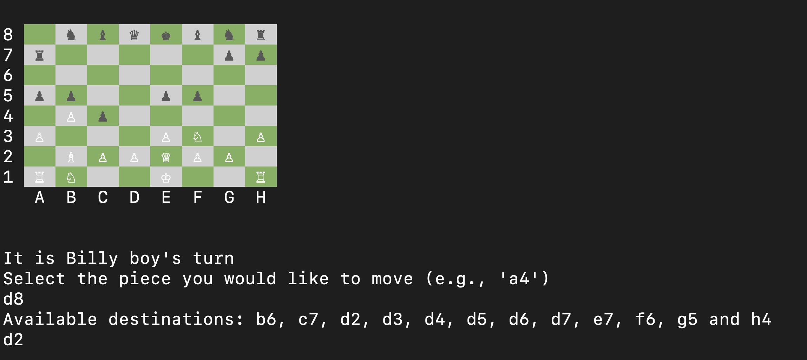
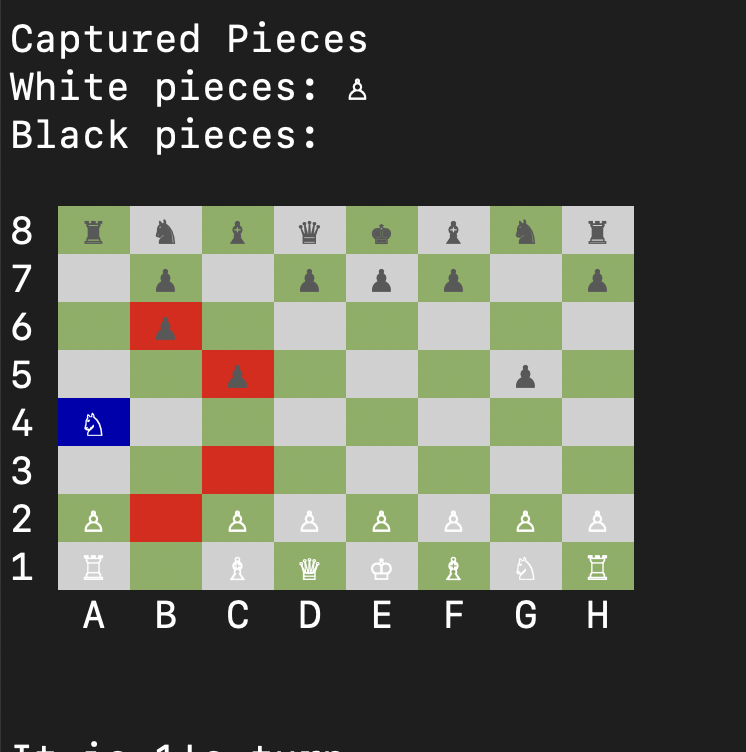
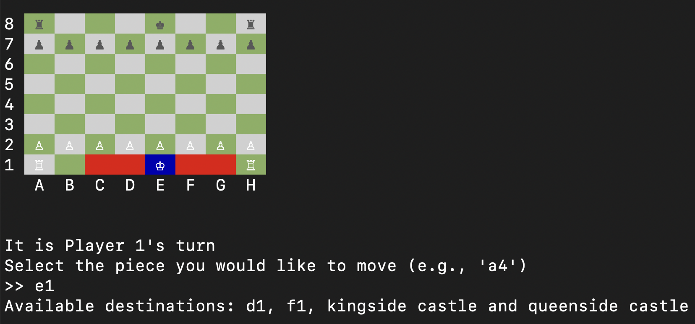
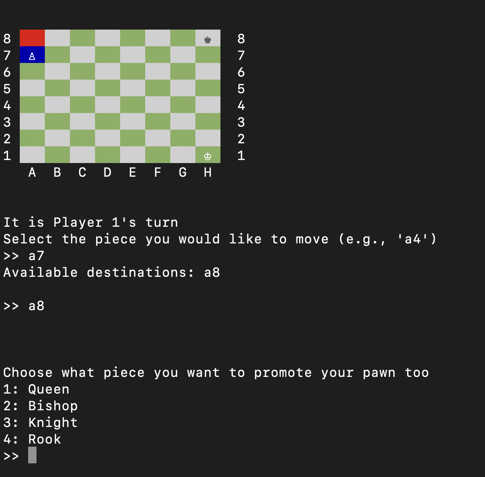
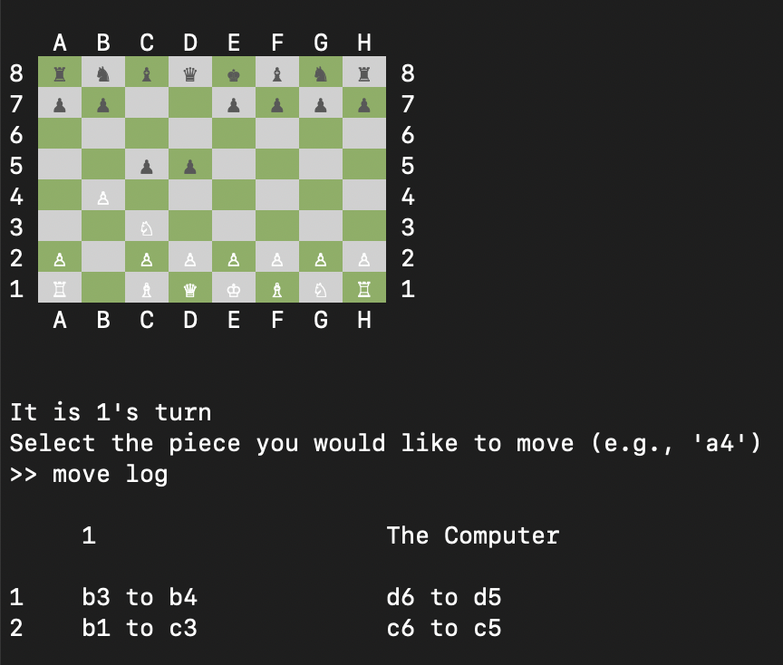

# Terminal Chess in Ruby

[](https://github.com/AbrasiveSquid/chess/actions/workflows/ci.yml)

A playable chess implementation for the terminal. It supports local
multiplayer, single-player games against a computer opponent, and
computer-versus-computer simulations.

I originally built this project while teaching myself programming before
beginning my computer science degree. Working on it was a major part of what led
me to pursue computer science.



## Features

- Standard piece movement and capture validation
- Check, checkmate, and stalemate detection
- Castling, en passant, and pawn promotion
- Single-player, local two-player, and simulated computer games
- Highlighted piece selections and legal destinations
- Save and load support using JSON
- Start a game from FEN notation
- FEN board-state display and move history during play
- Automated RSpec test suite and GitHub Actions CI

The computer opponent selects randomly from its legal moves. It is intended as
a playable opponent and a way to exercise the game engine, rather than as a
chess engine designed for competitive play.

## Requirements

- Ruby 3.4.6
- Bundler 2.6.9 or a compatible version
- A terminal with ANSI colour and Unicode support

The repository includes `.ruby-version`, a `Gemfile`, and `Gemfile.lock` so the
development environment can be reproduced.

## Installation

Clone the repository and install its dependencies:

```bash
git clone https://github.com/AbrasiveSquid/chess.git
cd chess
bundle install
```

If you use `rbenv`, install and select the required Ruby version first:

```bash
rbenv install 3.4.6
rbenv local 3.4.6
gem install bundler
bundle install
```

## Running the game

```bash
bundle exec ruby lib/main.rb
```

The opening menu lets you:

1. Start a new game.
2. Load a previously saved game.
3. Start from FEN notation.

For a new game, choose between single player, local multiplayer, or a simulated
computer-versus-computer game.

## Playing

Enter board coordinates such as `e2` to select a piece, followed by a legal
destination such as `e4`. The selected piece and its available destinations are
highlighted on the board.

These commands can be entered when the game asks you to select a piece:

| Command | Action |
| --- | --- |
| `save` | Save the current game and exit |
| `fen` | Display the current board state as FEN notation |
| `move log` | Display the moves made by both players |
| `exit` or `quit` | Exit without saving |

When castling is available, enter `k` for kingside castling or `q` for
queenside castling.

## Gameplay examples

| Legal move highlighting | Castling options |
| --- | --- |
|  |  |

| Pawn promotion | Move history |
| --- | --- |
|  |  |

## Starting from FEN notation

Choose option 3 from the opening menu and enter a position such as:

```text
rnbqkbnr/pppppppp/8/8/8/8/PPPPPPPP/RNBQKBNR w KQkq -
```

The game accepts the first four FEN fields:

1. Piece placement
2. Active colour (`w` or `b`)
3. Castling availability
4. En passant target square

Halfmove and fullmove counters are not currently used.

## Tests

Run the complete RSpec suite with:

```bash
bundle exec rspec
```

The suite contains more than 150 examples covering piece movement, legal move
generation, special moves, check and endgame detection, FEN validation, saving,
and game behaviour. It also runs automatically on every push and pull request
through GitHub Actions.

## Technical overview

The game is organized around small Ruby classes with separate responsibilities:

- `Game` coordinates turns, input, game modes, and end conditions.
- `Board` and the board-square classes render the terminal interface.
- `AvailableMoves`, `LegalMove`, and the piece classes generate and validate
  moves.
- `Check` and `Checkmate` evaluate threats, checkmate, and stalemate.
- `Castling`, `EnPassant`, and `Promotion` implement special rules.
- `Fen` validates imported positions, while `SaveGame` persists games as JSON.

Board positions are stored using FEN-style notation. Legal moves are tested by
simulating the resulting position and rejecting any move that leaves the active
player's king in check.

## Possible future improvements

- Add a stronger computer opponent using board evaluation and search
- Support the complete six-field FEN format
- Add draw detection for repetition, the fifty-move rule, and insufficient
  material
- Package the game as an installable command-line application

Bug reports and suggestions are welcome through
[GitHub Issues](https://github.com/AbrasiveSquid/chess/issues).
